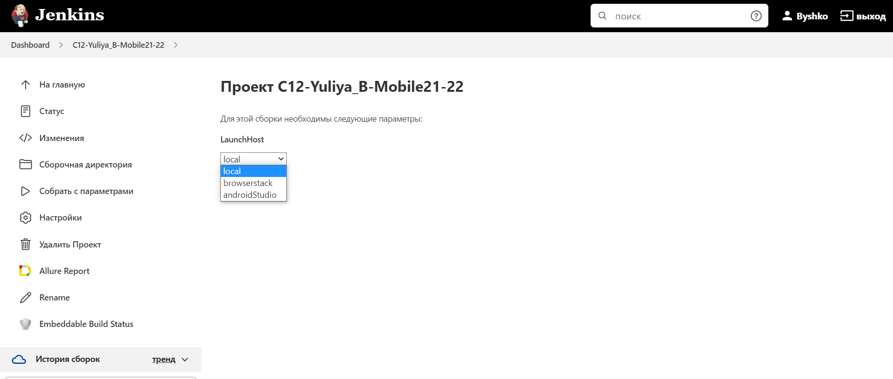
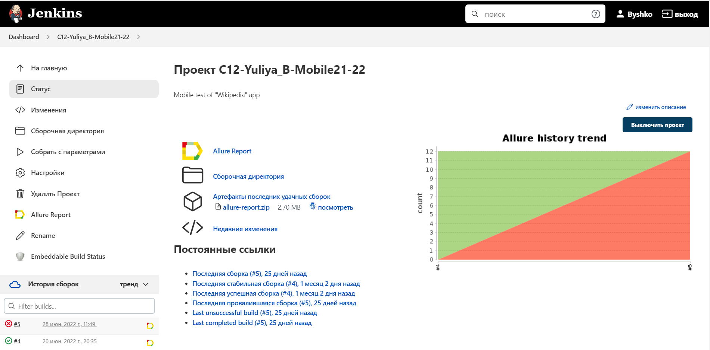
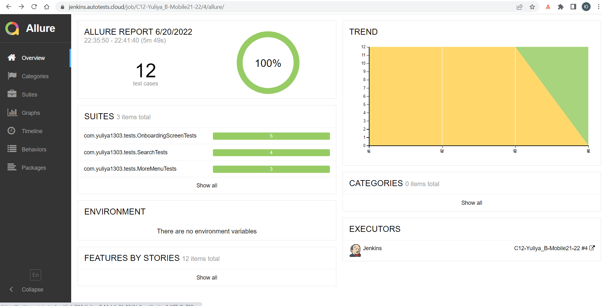
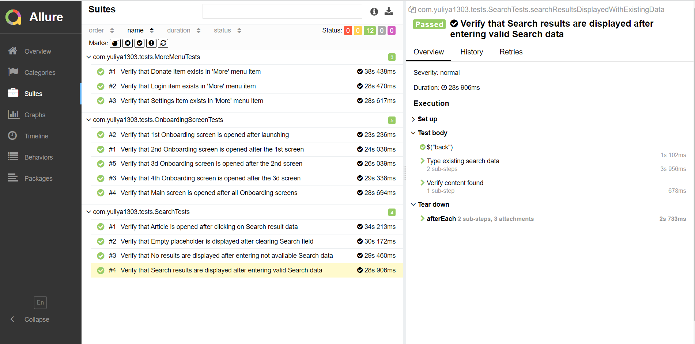
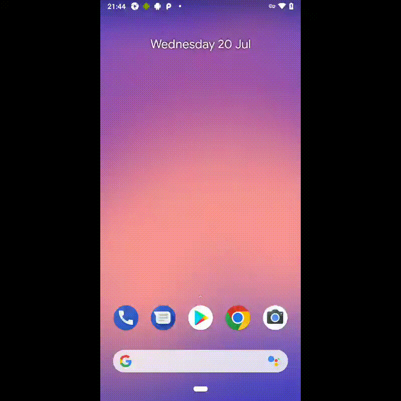

# Автоматизации тестирования мобильного Android приложения Wikipedia
## :link: <a target="_blank" href="https://github.com/wikimedia/apps-android-wikipedia/releases/tag/latest">GitHub - Wikipedia .apk файл</a>

## :page_with_curl: Содержание:

- <a href="#computer-сode_stack">Технологии и инструменты</a>
- <a href="#clipboard-реализованные-проверки">Реализованные проверки</a>
- <a href="#robot-сборки-в-Jenkins">Сборка в Jenkins</a>
- <a href="#keyboard-запуск-из-терминала">Запуск из терминала</a>
- <a href="#bar_chart-allure-отчет">Allure отчет</a>
- <a href="#film_projector-видео-пример-прохождения-тестов">Видео пример прохождения тестов</a>

## :computer: Технологии и инструменты
<p align="left">


</p>

## :clipboard: Реализованные проверки
- Проверка наличия Onboarding страниц и их переключение :heavy_check_mark:
- Проверка вывода результатов Поиска :heavy_check_mark:
- Проверка наличия всех пунктов в "More" меню :heavy_check_mark:

## :robot: Сборка в Jenkins
### <a target="_blank" href="https://jenkins.autotests.cloud/job/C12-Yuliya_B-Mobile21-22/">Параметризированная сборка в Jenkins</a>
<p align="center">

</p>
<p align="center">

</p>

## :keyboard: Пример файла browserstackCredentials.properties
> Файл browserstackCredentials.properties необходим для запуска тестов в Browserstack
- Локация файла:
```
src/test/resources/config/browserstackCredentials.properties
```
- Содержание файла:
```
user=
key=
```

## :keyboard: Запуск из терминала
Локальный запуск тестов с локального устройства:
```
gradle clean -Dlaunch=local
```
Запуск тестов с browserstack:
```
gradle clean -Dlaunch=browserstack
```
Запуск тестов с Android Studio:
```
gradle clean -Dlaunch=androidStudio
```

## :bar_chart: Allure отчет
- ### Главный экран отчета
<p align="center">

</p>

- ### Страница с проведенными тестами
<p align="center">

</p>

## :film_projector: Видео пример прохождения тестов
> К каждому тесту в отчете прилагается видео. Одно из таких видео представлено ниже.
<p align="center">
  
</p>
